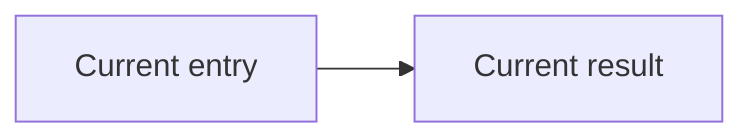
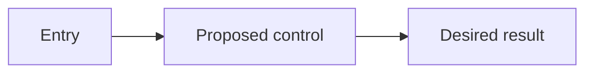

# <Design Title>

## Summary of Change Request

<What the user wants to build based on the request and ticket.>

## Current State

- <Current product behavior or user experience, without implementation detail.>

## Desired End State

- <Observable behavior that will be true when the work is complete.>

## Non-goals

- <Explicitly excluded behavior or scope.>

## Proposed End-State Architecture

### Before



### After



<Concise architecture explanation, interfaces, and pseudocode where useful.>

## Design Questions

### <Open decision>

<One consequential question.>

- **Option A**: <approach and tradeoffs>
- **Option B**: <approach and tradeoffs>

**Recommendation**: <option and evidence-based reason>

## Resolved Design Questions

### Smallest Viable Control

**Decision**: <selected existing control surface or justified new control>

**Rationale**: <why this is the least complex sufficient scope>

**Rejected options**: <other credible options and why they were not selected>

### <Resolved decision>

**Decision**: <selected option>

**Rationale**: <evidence-based reason>

**Rejected options**: <brief rationale>

## Patterns to Follow

### <Pattern title>

<What the pattern establishes and where it lives.>

```text
<concise existing-code excerpt or signature>
```

## Testing Approach

- <Existing test pattern and repository-relative location>
- <Expected automated coverage>
